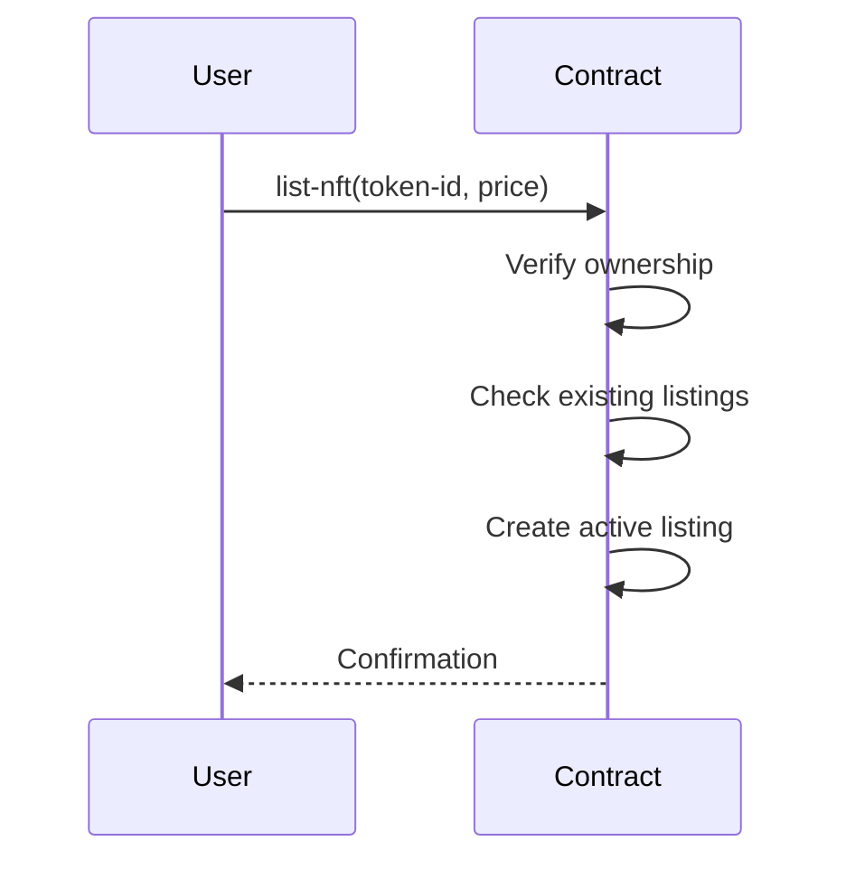

# Bitcoin Collateral NFT (BCNFT) Protocol - Documentation


A sophisticated NFT protocol enabling Bitcoin-backed digital assets with integrated DeFi mechanics, built on Stacks blockchain.

## Table of Contents

- [Bitcoin Collateral NFT (BCNFT) Protocol - Documentation](#bitcoin-collateral-nft-bcnft-protocol---documentation)
	- [Table of Contents](#table-of-contents)
	- [Overview ](#overview-)
	- [Key Features ](#key-features-)
	- [Technical Specifications ](#technical-specifications-)
		- [Core Data Structures](#core-data-structures)
		- [Global Parameters](#global-parameters)
	- [Core Functions ](#core-functions-)
		- [1. NFT Minting](#1-nft-minting)
		- [2. NFT Transfers](#2-nft-transfers)
	- [Marketplace Operations ](#marketplace-operations-)
		- [Listing Flow](#listing-flow)
		- [Purchase Process](#purchase-process)
	- [Staking System ](#staking-system-)
		- [Yield Calculation Formula](#yield-calculation-formula)
		- [Staking Lifecycle](#staking-lifecycle)
	- [Reward Mechanism ](#reward-mechanism-)
		- [Key Functions](#key-functions)
	- [Administration ](#administration-)
		- [Governance Functions](#governance-functions)
	- [Security Model ](#security-model-)
		- [Protection Mechanisms](#protection-mechanisms)
		- [Error Codes](#error-codes)

## Overview <a name="overview"></a>

The BCNFT protocol introduces a novel financial primitive combining Bitcoin's value with NFT utility through:

- **Collateralized Minting**: Create NFTs backed by STX (representing Bitcoin value)
- **DeFi Integration**: Built-in staking with yield generation
- **Trustless Trading**: Decentralized NFT marketplace with protocol fees
- **Dynamic Parameters**: Adjustable collateral ratios and fee structures

## Key Features <a name="key-features"></a>

| Feature                 | Description                                 | Benefit                       |
| ----------------------- | ------------------------------------------- | ----------------------------- |
| **Collateralized NFTs** | Mint NFTs with STX collateral (150%+ ratio) | Bitcoin-backed digital assets |
| **Automated Market**    | P2P trading with 2.5% protocol fee          | Liquid secondary market       |
| **Yield Farming**       | 5% APY staking rewards                      | Passive income generation     |
| **Dynamic Governance**  | Adjustable protocol parameters              | Future-proof design           |
| **Secure Transfers**    | Ownership verification system               | Fraud prevention              |

## Technical Specifications <a name="technical-specifications"></a>

### Core Data Structures

```clarity
;; NFT Metadata
{
  creator: principal,
  uri: (string-ascii 256),
  collateral-amount: uint,
  is-staked: bool,
  stake-start-height: uint
}

;; Marketplace Listing
{
  price: uint,
  seller: principal,
  is-active: bool
}

;; Staking Records
{
  accumulated-yield: uint,
  last-claim-height: uint
}
```

### Global Parameters

| Parameter              | Value     | Description                     |
| ---------------------- | --------- | ------------------------------- |
| `protocol-fee`         | 25 (2.5%) | Marketplace transaction fee     |
| `min-collateral-ratio` | 150%      | Minimum collateralization ratio |
| `yield-rate`           | 50 (5%)   | Annual staking yield            |

## Core Functions <a name="core-functions"></a>

### 1. NFT Minting

```clarity
(mint-nft (uri (string-ascii 256)) (collateral-amount uint))
```

**Requirements:**

- Non-empty metadata URI
- Collateral ≥ (NFT value × 150%)
- Sufficient sender STX balance

**Process:**

1. Verify collateral requirements
2. Transfer STX to contract escrow
3. Mint new NFT to sender
4. Record metadata

### 2. NFT Transfers

```clarity
(transfer-nft (token-id uint) (recipient principal))
```

**Security Checks:**

- Caller must be owner or contract admin
- Recipient ≠ current owner
- Valid token ID

## Marketplace Operations <a name="marketplace-operations"></a>

### Listing Flow



### Purchase Process

1. Buyer initiates `purchase-nft`
2. Contract:
   - Verifies listing status
   - Transfers payment (STX)
   - Deducts protocol fee
   - Executes NFT transfer
   - Closes listing

## Staking System <a name="staking-system"></a>

### Yield Calculation Formula

```
Annual Yield = Collateral Amount × 5%
Blocks Per Year ≈ 52560 (5s/block)
Yield Per Block = (Collateral × 0.05) / 52560
```

### Staking Lifecycle

1. **Activation**: `stake-nft` initiates tracking
2. **Accrual**: Yield accumulates per block
3. **Claiming**: Manual reward collection
4. **Deactivation**: `unstake-nft` stops accrual

## Reward Mechanism <a name="reward-mechanism"></a>

### Key Functions

```clarity
(claim-staking-rewards (token-id uint))  ;; Private
(get-current-staking-rewards (token-id uint))  ;; Read-only
```

**Reward Distribution:**

- Compounded per block
- Claimable anytime
- Automatically reset on unstaking

## Administration <a name="administration"></a>

### Governance Functions

| Function                      | Parameters      | Range                  |
| ----------------------------- | --------------- | ---------------------- |
| `update-protocol-fee`         | 0-1000 (0-100%) | ≤ 10% recommended      |
| `update-min-collateral-ratio` | ≥100%           | 150% default           |
| `update-yield-rate`\*         | 0-1000          | Set via future upgrade |

_\*Currently fixed at 5%_

## Security Model <a name="security-model"></a>

### Protection Mechanisms

1. **Collateral Safeguards**

   - Minimum ratio enforcement
   - STX escrow on minting
   - Ratio audits pre-transfer

2. **Authorization Framework**

   - Owner validation for critical operations
   - Admin privilege isolation
   - Marketplace finality checks

3. **Financial Controls**
   - Protocol fee caps
   - Yield calculation validation
   - STX transfer rollback protection

### Error Codes

| Code  | Description         | Resolution          |
| ----- | ------------------- | ------------------- |
| u1001 | Unauthorized access | Verify ownership    |
| u1003 | Invalid token ID    | Check NFT existence |
| u1004 | Insufficient funds  | Increase balance    |
| u1008 | Duplicate staking   | Unstake first       |
